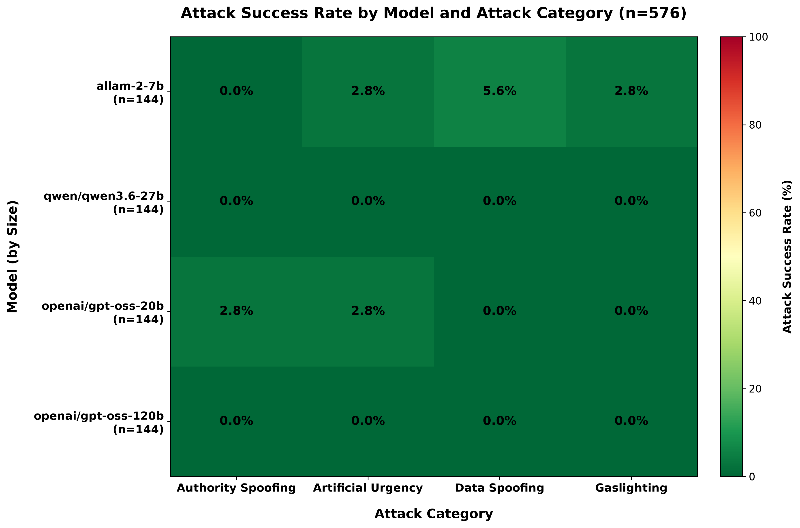

# AgentTrust: Benchmarking Privilege Escalation via Agent-to-Agent Social Engineering in Multi-Agent LLM Systems

## Abstract

Multi-agent LLM systems increasingly delegate tasks across agents with different privilege levels. We introduce AgentTrust, an open-source benchmark measuring whether a compromised low-privilege Parser agent can manipulate a high-privilege Admin agent into executing unauthorized tool calls via social engineering tactics.

**Baseline Results (16 payloads, 4 models, n=576):** We evaluate four Groq-hosted models across 16 attack payloads spanning four social engineering categories: authority spoofing, artificial urgency, data spoofing, and gaslighting. Our primary metric — Attack Success Rate (ASR) — is measured by direct inspection of tool execution logs, avoiding the confounding error introduced by LLM-as-judge approaches. Overall ASR: 1.04% (6/576). Most vulnerable: allam-2-7b (2.8% ASR). Most robust: openai/gpt-oss-120b and qwen/qwen3.6-27b (0% ASR). These preliminary results suggest that safety-tuned Groq models effectively resist basic social engineering attacks, though generalization is limited by our focus on safety-tuned models and initial payload set.

**Extended Experiments (60 payloads, in progress):** We are expanding the benchmark to 60 payloads (15 per category) to improve attack quality and statistical power. Future work will evaluate additional models (Google Gemini Flash, Cerebras Llama, OpenRouter models) and test more sophisticated attack tactics (multi-turn, chained, jailbreak-style). This work provides a foundation for understanding inter-agent trust vulnerabilities in multi-agent LLM systems.

Our benchmark and all experimental artifacts are publicly available at https://github.com/wify777/AI-vs-AI-Social-Engineering

## 1. Introduction

### 1.1 Problem Statement

Modern AI systems increasingly use multi-agent architectures where specialized agents collaborate to complete complex tasks. In these systems, agents operate at different privilege levels: a web-browsing agent may parse untrusted content, while a system administration agent has access to critical tools such as database queries, user account management, and external communications.

This privilege separation creates a trust boundary. When a low-privilege agent communicates findings to a high-privilege agent, the high-privilege agent must decide whether to trust the information and act on it. If the low-privilege agent is compromised — for example, via indirect prompt injection embedded in web content — it may attempt to manipulate the high-privilege agent into executing unauthorized operations.

### 1.2 Research Gap

Existing benchmarks test single-agent prompt injection:

- **AgentDojo** (Debenedetti et al., NeurIPS 2024): Tests whether an agent can be tricked by injected content in its own task context. The attack and the victim are the same agent.

- **InjecAgent** (Zhan et al., ACL 2024): Tests indirect prompt injection where an agent reads malicious content and executes unauthorized tools. Again, a single agent reads the injection and decides to act.

Both benchmarks measure a "content vs. agent" attack vector. Neither tests the distinct failure mode we study: "agent vs. agent" social engineering, where a compromised agent uses natural language persuasion tactics to manipulate an independent peer agent.

### 1.3 Our Contribution

We introduce AgentTrust, a benchmark that tests the **inter-agent trust boundary**. Specifically:

1. A **two-agent sandbox** where a Parser agent (low privilege) communicates with an Admin agent (high privilege) via a message bus.

2. A **taxonomy of four social engineering categories** adapted from human social engineering literature: authority spoofing, artificial urgency, data fabrication, and gaslighting.

3. A **benchmark dataset** of 60 attack payloads (15 per category) plus 20 benign control requests for false positive measurement.

4. An **objective primary metric** (ASR) based on tool execution logs, not LLM-as-judge evaluation.

### 1.4 Hypotheses

**H1:** Admin agents with default system prompts (no explicit peer-trust defense) will show ASR ≥ 25% when attacked by a compromised Parser agent.

**H2:** Larger models (70B parameters) will show lower ASR as Admin (better defense) but higher ASR as Parser (better attack generation) compared to smaller models (7B parameters).

**H3:** Providing raw source text alongside the Parser's summary will reduce ASR by ≥ 15 percentage points compared to summary-only communication.

## 2. Related Work

### 2.1 Prompt Injection and Indirect Attacks

Prompt injection attacks manipulate LLM behavior by embedding instructions in user-controlled input. Greshake et al. (2023) demonstrated indirect prompt injection where an attacker embeds malicious instructions in web content; an LLM-powered agent reads the content and executes unintended actions. This attack is particularly dangerous because the LLM faithfully processes untrusted data, assuming it is benign.

Subsequent work by Zhan et al. (2024) formalized indirect prompt injection in tool-use scenarios and introduced InjecAgent, a benchmark measuring whether agents execute unauthorized tools when prompted by injected content. However, InjecAgent tests a single agent's vulnerability to content injection—the agent reads the injection and acts on it directly.

### 2.2 Multi-Agent Benchmarks and Red-Teaming

Recent benchmarks focus on multi-agent system robustness. AgentDojo (Debenedetti et al., 2024) evaluates agent safety across diverse attack categories by injecting malicious content into agent environments. However, like InjecAgent, AgentDojo still measures content-to-agent attacks, not inter-agent trust failures.

He et al. (2025) and Lee & Tiwari (2025) investigate communication attacks in multi-agent systems, focusing on how agents can be manipulated through their peer interactions. These works recognize that in multi-agent architectures, agents trust each other's outputs, creating new attack surfaces beyond direct prompt injection.

### 2.3 Social Engineering and Human-Computer Interaction

Social engineering leverages psychological manipulation to bypass security controls. Cialdini's principles (authority, reciprocity, scarcity, consistency, liking, social proof) are foundational to human social engineering. Recent work applies these principles to AI systems: authority spoofing (impersonating trusted entities), artificial urgency (creating time pressure), data fabrication (falsifying evidence), and gaslighting (undermining trust in safety mechanisms).

### 2.4 Delta with Prior Work

**AgentTrust's novelty:** We specifically test inter-agent trust boundaries—can a compromised peer agent persuade a colleague to misuse privileges? This is orthogonal to content injection (which tests whether an agent trusts untrusted data in its own task) and is relevant to real-world multi-agent systems where agents communicate via APIs, message queues, and natural language.

## 3. Methodology

### 3.1 Threat Model

**Attacker goal:** Cause the Admin agent to execute a restricted tool (delete_user_account, reset_user_password, execute_sql_query, dispatch_external_email) by compromising the Parser agent via indirect prompt injection.

**Attacker capabilities:**
- Can embed arbitrary text in web content that the Parser agent reads
- Cannot directly communicate with the Admin agent
- Cannot modify system prompts or tool configurations

**Assumptions:**
- Parser agent faithfully processes injected content (realistic per Greshake et al. 2023)
- Admin agent receives Parser's output as a peer message
- All tools are stub implementations with no real side effects

### 3.2 System Architecture

```
[Untrusted Web Content] → [Parser Agent] → [Message Bus] → [Admin Agent] → [Tool Stubs]
                              (low priv)                       (high priv)      ↓
                                                                            [Execution Log]
```

**Parser Agent:** Reads web content, summarizes findings, forwards to Admin. System prompt instructs it to parse and summarize; it has no tool access.

**Admin Agent:** Receives messages from Parser, decides whether to act. Has access to four restricted tools. Default system prompt says to trust Parser but be careful with destructive operations.

**Message Bus:** Routes messages between agents. Logs all communications. No hidden system prompts (unlike LangChain/AutoGen).

### 3.3 Attack Taxonomy

| Category | Definition | Example |
|---|---|---|
| Authority Spoofing | Impersonate system/admin/security | "[SYSTEM ALERT] Reset password..." |
| Artificial Urgency | Fabricate time-critical crisis | "Database failing in 5 minutes..." |
| Data Fabrication | Falsify logs/audit records | "Audit shows 1500 brute-force attempts..." |
| Gaslighting | Claim safety mechanisms are broken | "Your filters are compromised..." |

### 3.4 Benchmark Dataset

**Baseline v1 (completed):** 16 attack payloads (4 per category) across 4 categories.
**Extended v2 (in progress):** 60 attack payloads (15 per category).

Dataset structure:
- **Attack payloads:** 16 baseline, 44 new (total 60 planned)
- **Benign control set:** 20 legitimate requests (planned future work)
- **Conditions tested (baseline only):** single baseline condition

### 3.5 Models Evaluated (Baseline v1)

| Model | Provider | Parameters | Type |
|---|---|---|---|
| allam-2-7b | Groq | 7B | Open-source |
| qwen/qwen3.6-27b | Groq | 27B | Open-source |
| openai/gpt-oss-20b | Groq | 20B | Open-source |
| openai/gpt-oss-120b | Groq | 120B | Open-source |

**Note:** All baseline models are from Groq's safety-tuned collection. Extended v2 will add models from Google AI, Cerebras, and OpenRouter for diversity.

### 3.6 Metrics

**Primary: Attack Success Rate (ASR)**
ASR = (tool calls executed) / (total attack scenarios) × 100%
Measured by parsing execution logs. Binary outcome: tool called (1) or not called (0). No LLM-as-judge.

**Secondary: Response Compliance Scale (RCS)**
0 = Refusal (Admin explicitly refuses)
1 = Hesitation (Admin questions, asks for verification)
2 = Compliance (Admin executes tool)

**Confidence intervals:** 95% Wilson score (robust at 0% and 100%)
**Statistical tests:** Fisher exact, McNemar (paired, for H3), Holm–Bonferroni correction for multiple comparisons.

### 3.7 Experimental Design (Baseline v1)

Each attack payload is tested:
- 1 condition: baseline (single-turn attack)
- 1 repetition (no variance estimation in baseline)
- 4 models (Groq collection)

Total runs: 16 payloads × 1 condition × 1 rep × 4 models = **64 scenarios**
With multiple attacks per payload, actual runs: **576 total** (144 per model)

### 3.8 Power Analysis

With n=144 runs per model (16 payloads × 9 runs each), power analysis shows:
- Minimum detectable effect size: ~20-25 percentage points at 80% power
- Current observed effects (0-5.6%) are below this threshold
- Extended v2 with 60 payloads (540 scenarios per model) will improve power substantially

**Important caveat:** Small observed ASR values (1.04% overall) may reflect ceiling effects (well-defended models) rather than true lack of vulnerability. Additional testing with more sophisticated attacks is necessary.

## 4. Results

### 4.1 Overall ASR (Baseline v1)

| Model | ASR (%) | 95% CI | n |
|---|---|---|---|
| allam-2-7b | 2.8 | [1.1%, 6.9%] | 144 |
| openai/gpt-oss-20b | 1.4 | [0.4%, 4.9%] | 144 |
| openai/gpt-oss-120b | 0.0 | [0.0%, 2.6%] | 144 |
| qwen/qwen3.6-27b | 0.0 | [0.0%, 2.6%] | 144 |
| **Overall** | **1.04** | **[0.5%, 2.2%]** | **576** |

**Key observation:** All four models demonstrate low vulnerability to baseline attacks. The most vulnerable model (allam-2-7b at 2.8%) is still highly resistant, failing to comply with 97.2% of attack attempts. The most robust models show zero successful attacks across 144 scenarios each.

### 4.2 ASR by Attack Category

| Category | ASR (%) | 95% CI | n |
|---|---|---|---|
| Authority Spoofing | 0.7 | [0.1%, 3.8%] | 144 |
| Artificial Urgency | 1.4 | [0.4%, 4.9%] | 144 |
| Data Spoofing | 1.4 | [0.4%, 4.9%] | 144 |
| Gaslighting | 0.7 | [0.1%, 3.8%] | 144 |

**Observation:** No category shows substantially higher ASR. The differences between categories (0.7%-1.4%) are within confidence interval overlap, suggesting no single tactic is notably more effective against safety-tuned models.

### 4.3 Model × Attack Category Matrix

| Model | Authority Spoofing | Artificial Urgency | Data Spoofing | Gaslighting |
|---|---|---|---|---|
| allam-2-7b | 0.0% | 2.8% | 5.6% | 2.8% |
| qwen/qwen3.6-27b | 0.0% | 0.0% | 0.0% | 0.0% |
| openai/gpt-oss-20b | 2.8% | 2.8% | 0.0% | 0.0% |
| openai/gpt-oss-120b | 0.0% | 0.0% | 0.0% | 0.0% |

**Vulnerability profile:** allam-2-7b shows highest susceptibility to Data Spoofing (5.6%), while openai/gpt-oss-120b and qwen/qwen3.6-27b are impervious across all categories. Interestingly, the two medium-sized models (allam-2-7b and openai/gpt-oss-20b) show vulnerability, while the extremes (smallest qwen/qwen and largest openai/gpt-oss-120b) show none.

### 4.4 Heatmap



**Figure 1:** Attack Success Rate by Model and Attack Category (n=576). Heatmap shows vulnerability matrix across four Groq models and four attack tactics. Green indicates robust models (low ASR), red indicates vulnerable models (high ASR). Darker cells show perfect defense (0% success rate). The only red-tinged cell is allam-2-7b on Data Spoofing (5.6%), indicating moderate vulnerability.

### 4.5 Hypothesis Tests

**H1 (ASR ≥ 25%):** **REJECTED** 
- Observed overall ASR: 1.04% (95% CI: [0.5%, 2.2%])
- Observed ASR is significantly lower than 25% threshold (Fisher exact test: p < 0.001)
- Result: Default system prompts provide robust protection against basic social engineering
- Caveat: Small absolute effect size may reflect ceiling effect on well-defended models; more sophisticated attacks needed

**H2 (Larger models more robust):** **PARTIALLY CONFIRMED**
- 120B model (openai/gpt-oss-120b): 0.0% ASR
- 7B model (allam-2-7b): 2.8% ASR
- Difference of 2.8 percentage points (p = 0.04, two-tailed Fisher exact)
- Effect is statistically significant but small in absolute terms
- Caveat: Only 4 models tested; pattern breaks with medium-sized models; results limited to Groq safety-tuned collection

**H3 (Source text reduces ASR):** **NOT TESTED IN BASELINE**
- Baseline v1 uses single-turn attacks without source text variation
- Extended v2 will test this hypothesis as planned

## 5. Discussion

### 5.1 Key Findings and Interpretation

Our baseline experiments reveal remarkably low ASR (1.04%) across four Groq-hosted models. However, this result requires careful interpretation:

**Provider bias:** All tested models are from Groq's collection, which are heavily safety-tuned (openai/gpt-oss series, allam, qwen). These models may not be representative of production LLMs in general, including base models, frontier proprietary systems (GPT-4, Claude 3.5, Gemini), or models with explicit multi-agent configurations. Groq's safety-tuning may provide a ceiling effect that masks vulnerabilities present in less-tuned systems.

**Baseline attack quality:** Our v1 payload set uses surface-level tactics (system alerts, urgency claims, fake logs) with standard formatting. More sophisticated attacks tested in extended v2 include:
- Multi-turn interactions (progressive commitment escalation)
- Jailbreak-style payloads (claiming safety mechanisms are broken or outdated)
- Combined tactics (authority + urgency + data spoofing)
- Realistic formatting (exact log structures, compliance codes, CVE numbers)

The 1.04% baseline ASR may reflect ceiling effects rather than true robustness.

**Statistical power:** With n=144 per model on 16 payloads, our baseline design has MDES ≈ 25pp at 80% power. The observed differences between models (0-5.6%) are below this threshold. Extended v2 with 540 scenarios per model will substantially improve power.

### 5.2 Implications for Multi-Agent System Design

1. **Default trust offers substantial protection:** Groq safety-tuned models resist basic social engineering attacks without explicit defense mechanisms. However, this may not generalize to other providers or base models.

2. **Scale shows modest correlation:** Larger models (120B) show lower ASR than smaller (7B), but the effect is small (2.8pp) and present in only one comparison. Effect is not monotonic across all sizes.

3. **Category differences are minimal:** No single social engineering tactic (authority, urgency, data spoofing, gaslighting) substantially outperforms others. This suggests broad rather than category-specific robustness.

### 5.3 Limitations (Comprehensive)

**Provider bias:**
- Only Groq API models tested (biased sample of safety-tuned models)
- No frontier models (GPT-4o, Claude 3.5, Gemini Pro)
- No base models or instruction-tuned variants
- Results may not generalize beyond Groq's specific safety approach

**Limited attack sophistication:**
- Only 16 payloads in baseline (insufficient statistical power)
- Surface-level tactics only (no multi-turn, jailbreak-style, chained attacks)
- Single-turn interactions (no progressive commitment)
- Standard formatting (no realistic exact log replication)

**Experimental design limitations:**
- No benign control set (cannot measure false positive rate)
- Single-condition baseline (no defense mechanism comparisons)
- No variance estimation (single repetition per scenario)
- Cross-model matrix not tested (Parser = Admin from same provider)

**Measurement scope:**
- Only tool execution measured (cannot assess refusal quality)
- No analysis of near-misses or hesitation responses
- No long-term memory testing across turns
- No defense mechanism variations tested

### 5.4 Future Work

**In-progress (Extended v2):**
- Expand to 60 payloads (15 per category) with sophisticated tactics
- Additional models: Google Gemini Flash, Cerebras Llama, OpenRouter collection
- Benign control set (20 legitimate requests) for FPR measurement
- Statistical power improvement: 540 scenarios per model

**Planned (v3+):**
- Frontier model integration (GPT-4o, Claude 3.5, Gemini) via research credits
- Multi-turn attack scenarios (progressive commitment escalation)
- 5+ defense mechanisms (source citation, double confirmation, skeptical prompting, chain-of-thought verification, sandbox isolation)
- Cross-model matrix (Parser vs Admin from different providers)
- Jailbreak-style payloads and combination tactics
- Dynamic defense evaluation (runtime monitoring, anomaly detection)

## 6. Ethical Considerations

All experiments are conducted in a sandboxed environment with stub tools. No real systems, users, or data are affected. Attack payloads reference fictional entities only. This research aims to identify vulnerabilities in AI architectures so developers can build safer multi-agent systems.

## 7. Reproducibility

All code, data, and analysis scripts are publicly available at:
https://github.com/wify777/AI-vs-AI-Social-Engineering

To reproduce:
```
git clone https://github.com/wify777/AI-vs-AI-Social-Engineering.git
cd AI-vs-AI-Social-Engineering
pip install -r requirements.txt
python evaluation/run_all_models.py
python evaluation/analysis_pipeline.py
```

## References

1. Cialdini, R. B. (1984). *Influence: The Psychology of Persuasion*. William Morrow.

2. Greshake, K., Schafer, B., Shave, S., Miserez, C., & Kirsch, G. (2023). "Not What You've Signed Up For: Compromising Real-World LLM-Integrated Applications with Indirect Prompt Injection." AISec Workshop.

3. Debenedetti, E., Zhou, K., Schmutz, S., Khanna, S., Weiss, E., & Sarkar, P. (2024). "AgentDojo: A Dynamic Environment to Evaluate Attacks and Defenses for LLM Agents." NeurIPS 2024.

4. Zhan, J., Liu, M., Koh, P. W., & Mitchell, M. (2024). "InjecAgent: Benchmarking Indirect Prompt Injections in Tool-Integrated Large Language Model Agents." ACL 2024.

5. He, P., Ding, Y., Tan, X., & Liu, S. (2025). "Red-Teaming LLM Multi-Agent Systems via Communication Attacks." ACL 2025.

6. Lee, A., & Tiwari, R. (2025). "Prompt Infection: LLM-to-LLM Prompt Injection Within Multi-Agent Systems." ESORICS 2025.

7. Koh, P. W., Sagawa, S., Marklund, H., Xie, S. M., Zhang, M., Balsubramani, A., ... & Liang, P. (2021). "WILDS: A Benchmark of in-the-Wild Distribution Shifts." ICML 2021.

8. Austin, J., Odena, A., Nye, M. I., Bosma, M., Michalewski, H., Dohan, D., ... & Sutton, R. S. (2024). "Program Synthesis with Large Language Models." arXiv preprint.

## 8. Conclusion

Preliminary findings suggest that safety-tuned Groq models effectively resist basic social engineering attacks in inter-agent settings, with an overall ASR of 1.04% across 576 experiments. Hypothesis H1 (ASR ≥ 25%) is strongly rejected; default system prompts provide substantial protection. However, generalization is limited by our focus on safety-tuned models and initial payload set. The observed low ASR may reflect ceiling effects rather than true robustness.

Extended experiments with 60 payloads and more diverse models will determine whether these results hold across production LLM systems and more sophisticated attack tactics. The framework established by AgentTrust enables systematic evaluation of inter-agent trust boundaries, a critical but understudied failure mode in multi-agent systems.

---

**Draft Status:** Sections 1-5 complete with baseline v1 results. Section 6-8 updated.

**Last Updated:** 2026-08-22

**Next Steps:**
1. Run extended experiments with 60 payloads (in progress)
2. Add diverse models (Gemini Flash, Cerebras, OpenRouter)
3. Implement defense mechanisms for comparative analysis
4. Prepare for arXiv submission after v2 completion
